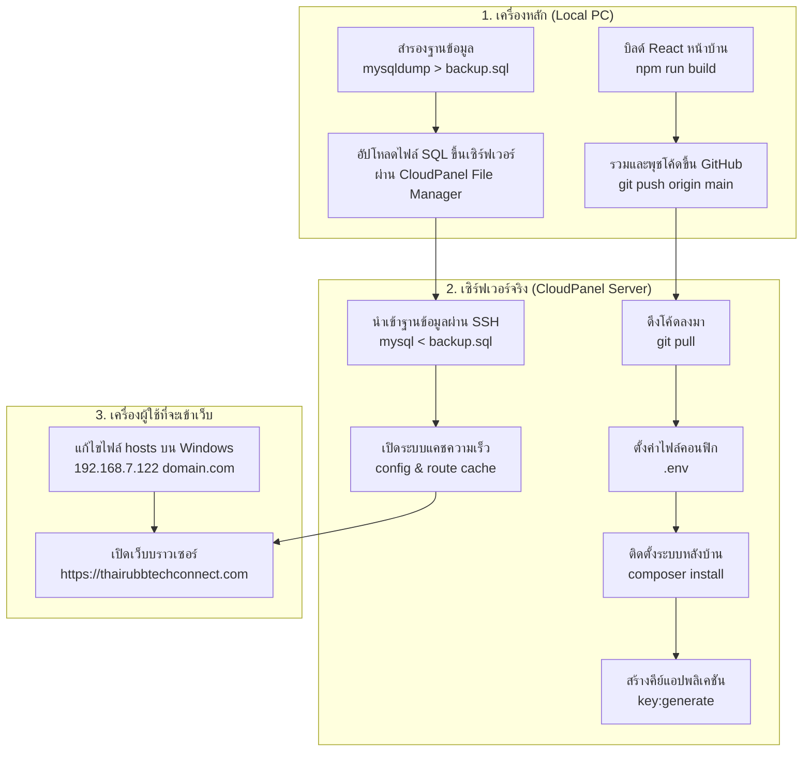

# คู่มือการย้ายระบบพนักงานและฐานข้อมูล (Local to CloudPanel Deployment Guide)

เอกสารนี้สรุปขั้นตอนอย่างละเอียดที่สุด (Step-by-Step) สำหรับการย้ายระบบแอปพลิเคชัน **TRT HR System** และฐานข้อมูลพนักงานทั้งหมด จากเครื่องจำลองของนักพัฒนา (Local PC / Docker) ขึ้นสู่เซิร์ฟเวอร์จริง (Production Server) ที่ควบคุมผ่าน **CloudPanel** พร้อมรวบรวมข้อควรระวังและแนวทางการแก้ไขปัญหาที่พบบ่อย

---

## 📋 แผนภาพภาพรวมการย้ายระบบ (Deployment Flow)



---

## 🚀 ลำดับขั้นตอนการย้ายระบบโดยละเอียด (Step-by-Step Guide)

### เฟสที่ 1: เตรียมการที่เครื่องของนักพัฒนา (Local PC)

#### 1. บิลด์โค้ดหน้าบ้าน (React)

เนื่องจากบนเซิร์ฟเวอร์ CloudPanel ไม่มี Node.js/npm เราจึงต้องทำการคอมไพล์โค้ดหน้าบ้านให้เรียบร้อยจากเครื่องเราก่อนส่งขึ้น Git:

- เปิดไฟล์ `.gitignore` ในเครื่อง แล้วทำการคอมเมนต์เอาเครื่องหมาย `#` นำหน้าบรรทัด `/public/build` ออก เพื่อยอมให้พุชไฟล์บิลด์ขึ้น Git
- รันคำสั่งบิลด์หน้าบ้านผ่าน Docker:
    ```bash
    docker compose exec app npm run build
    ```

#### 2. รวมกิ่งโค้ดและส่งขึ้น GitHub (Merge & Push)

รวมโค้ดเวอร์ชันล่าสุดของสาขาพัฒนา (เช่น `Docker-install`) เข้าสู่สาขาหลัก (`main`):

```bash
git checkout main
git pull origin main
git merge Docker-install
git push origin main
```

#### 3. สำรองข้อมูล Database ที่มีอยู่เดิม (Export SQL)

ดึงข้อมูลและโครงสร้างฐานข้อมูลที่มีประวัติพนักงานเก็บเป็นไฟล์ `backup.sql`:

```bash
docker compose exec db mysqldump -u root -proot_password trt_hr_db > backup.sql
```

_(หมายเหตุ: หากตอนติดตั้งตั้งรหัสผ่านอื่นไว้ ให้เปลี่ยนคำว่า `root_password` ให้ตรงตามจริง)_

---

### เฟสที่ 2: ตั้งค่าระบบหน้าเว็บควบคุม (CloudPanel UI Setup)

1. **สร้างเว็บไซต์ใหม่ (Add Site):**
    - เลือกประเภทเป็น **PHP Site**
    - ตั้งชื่อโดเมนหลักเป็น `thairubbtechconnect.com`
    - เลือกเวอร์ชัน PHP ให้ตรงกับความต้องการของระบบ (เช่น PHP 8.4)
2. **ตั้งค่าพอยท์โฟลเดอร์หลัก (Document Root):**
    - เข้าไปตั้งค่าที่ชื่อเว็บ ➡️ แก้ไขโฟลเดอร์รันหน้าเว็บหลักให้ชี้เป้าเข้าที่โฟลเดอร์ **`/public`** เสมอ:
      📂 `/home/thairubbtechconnect/htdocs/thairubbtechconnect.com/public`
3. **สร้างฐานข้อมูลใหม่ (Databases):**
    - ตั้งชื่อฐานข้อมูลและชื่อผู้ใช้ฐานข้อมูล แนะนำให้ใช้ตัวเล็กล้วนไม่มีอักขระพิเศษ (เช่น DB Name: `thairubbtechdb` / User Name: `thairubbtechusr`)
    - ตั้งรหัสผ่านของฐานข้อมูล เช่น `#logic1122` และคัดลอกเก็บไว้
4. **สร้างผู้ใช้งาน SSH (SSH/FTP):**
    - สร้างสิทธิ์เพื่อใช้สำหรับล็อกอินเครื่องเซิร์ฟเวอร์ (เช่น User Name: `adminssh` / รหัสผ่าน: `#logic1122`) ส่วนช่อง SSH Keys สามารถปล่อยว่างไว้ได้

---

### เฟสที่ 3: ติดตั้งแอปพลิเคชันฝั่งหลังบ้าน (CLI Setup - Server SSH)

#### 1. รีโมทเชื่อมต่อ SSH เข้าเซิร์ฟเวอร์

เปิด Terminal ในเครื่องของคุณและทำการล็อกอิน:

```bash
ssh adminssh@192.168.7.122
```

_(ระบบจะถามรหัสผ่าน ให้ป้อนรหัสผ่านที่ตั้งในหน้า Cloud Panel)_

#### 2. ย้ายเข้าโฟลเดอร์โปรเจกต์และลบหน้าตั้งต้นออก

```bash
cd htdocs/thairubbtechconnect.com
rm -rf public
```

#### 3. ดึงโค้ดลงมาจาก GitHub

- ปลดล็อกระบบรักษาความปลอดภัยความเป็นเจ้าของของ Git:
    ```bash
    git config --global --add safe.directory /home/thairubbtechconnect/htdocs/thairubbtechconnect.com
    ```
- โคลนโค้ดลงมาในพื้นที่ปัจจุบัน (มีจุดต่อท้าย):
    ```bash
    git clone https://github.com/namnueng32371/TRT-HR-SYSTEM.git .
    ```

#### 4. ตั้งค่าไฟล์คอนฟิกหลัก (`.env`)

- คัดลอกสร้างไฟล์ `.env` จริง:
    ```bash
    cp .env.example .env
    ```
- เปิดแก้ไขไฟล์คอนฟิกด้วยคำสั่งแก้ไข:
    ```bash
    nano .env
    ```
- **⚠️ ข้อควรระวังสำคัญที่สุดเรื่องรหัสผ่านที่มีเครื่องหมาย `#` นำหน้า:**
  หากรหัสผ่านฐานข้อมูลของคุณขึ้นต้นด้วย `#` (เช่น `#logic1122`) **จำเป็นอย่างยิ่งต้องใช้เครื่องหมายฟันหนู `"..."` ครอบเอาไว้** เพื่อป้องกันระบบมองข้ามข้อมูลด้านหลังเนื่องจากเข้าใจผิดว่าเป็น Comment:

    ```env
    APP_NAME="TRT HR"
    APP_ENV=production
    APP_DEBUG=false
    APP_URL=https://thairubbtechconnect.com
    APP_KEY= # เพิ่มบรรทัดนี้เปล่าๆ ไว้รอสำหรับสร้างคีย์

    DB_CONNECTION=mysql
    DB_HOST=127.0.0.1
    DB_PORT=3306
    DB_DATABASE=thairubbtechdb
    DB_USERNAME=thairubbtechusr
    DB_PASSWORD="#logic1122" # <--- ต้องมีเครื่องหมายฟันหนูครอบ
    ```

- บันทึกและออก: กด **`Ctrl + O` ➡️ `Enter` ➡️ `Ctrl + X`**

#### 5. ติดตั้ง PHP libraries และสร้างคีย์ความปลอดภัย

```bash
# 1. ติดตั้งไลบรารีระบบหลักฝั่งหลังบ้าน
composer install --no-dev --optimize-autoloader

# 2. เจนเนอเรตสุ่มสร้างคีย์ความปลอดภัยเพื่อบันทึกลงในไฟล์ .env
php artisan key:generate

# 3. เชื่อมต่อโฟลเดอร์แสดงผลไฟล์อัปโหลดและรูปถ่ายพนักงาน
php artisan storage:link
```

---

### เฟสที่ 4: นำเข้าฐานข้อมูลและเพิ่มประสิทธิภาพเซิร์ฟเวอร์

1. **อัปโหลดไฟล์ SQL:** ไปที่หน้าเว็บ CloudPanel ➡️ เมนู **File Manager** ➡️ ย้ายเข้าไปที่โฟลเดอร์ `/htdocs/thairubbtechconnect.com` แล้วกด **Upload** เลือกไฟล์ `backup.sql` ที่เซฟมาจากเครื่องหลักของคุณขึ้นไปเก็บไว้บนเซิร์ฟเวอร์
2. **สั่งนำเข้าฐานข้อมูลผ่าน SSH:** รันคำสั่งนี้บนหน้าจอ SSH Terminal เพื่อดึงประวัติตารางและข้อมูลทั้งหมดเข้าสู่ฐานข้อมูล:
    ```bash
    mysql -u thairubbtechusr -p thairubbtechdb < backup.sql
    ```
    _(ระบุรหัสผ่านฐานข้อมูลที่คุณตั้งไว้ เช่น `#logic1122` แล้วกด Enter)_
3. **ลบไฟล์สำรองบนเซิร์ฟเวอร์เพื่อความสะอาดปลอดภัย:**
    ```bash
    rm backup.sql
    ```
4. **เปิดแคชระบบเพื่อเพิ่มความเร็วในการเปิดเว็บ:**
    ```bash
    php artisan config:cache
    php artisan route:cache
    php artisan view:clear
    php artisan cache:clear
    ```

---

### เฟสที่ 5: ตั้งค่าฝั่งเครื่องคอมพิวเตอร์หลักเพื่อเข้าใช้งาน (Hosts File Setup)

เพื่อให้เครื่องคอมพิวเตอร์ของคุณชี้ชื่อโดเมน `thairubbtechconnect.com` ไปยัง IP วงในของเครื่องเซิร์ฟเวอร์ UAT:

1. เปิดโปรแกรม **Notepad** บนคอมพิวเตอร์ของคุณในสิทธิ์ **Administrator (Run as administrator)**
2. กดเปิดไฟล์จากพาธ: **`C:\Windows\System32\drivers\etc\hosts`** _(เปลี่ยนแถบขวาเป็น All Files เพื่อค้นหา)_
3. พิมพ์สองบรรทัดด้านล่างนี้ลงล่างสุดของไฟล์ แล้วกดเซฟ (Ctrl + S):
    ```text
    192.168.7.122 thairubbtechconnect.com
    192.168.7.122 www.thairubbtechconnect.com
    ```

---

## 💡 สิ่งที่ต้องรู้ และคำถามที่พบบ่อยในการย้ายระบบ (Developer FAQs)

### Q: ทำไมระบบ UAT ไม่ต้องลง Node.js และรัน `npm install`?

**A:** เพราะเราใช้วิธีรันคอมไพล์บิลด์หน้าบ้านจากเครื่องหลักของเราแล้ว (`npm run build`) ซึ่งเป็นการแพ็กหน้าตาเว็บ (React) ทั้งหมดออกมาเป็นไฟล์ HTML/JS/CSS ธรรมดาเก็บลงในโฟลเดอร์ `/public/build` และส่งผ่าน Git ขึ้นไปอยู่แล้ว ทางเซิร์ฟเวอร์จึงหยิบไปใช้แสดงผลได้ทันทีโดยไม่ต้องรัน Node.js บน Server ให้เปลืองแรม

### Q: การย้ายฐานข้อมูลครั้งแรก ทำไมไม่ต้องรัน `php artisan migrate`?

**A:** เนื่องจากเราใช้วิธีการนำเข้าไฟล์ตรง (`Import SQL`) จากตัวเครื่องหลัก ซึ่งไฟล์ `backup.sql` ที่เราดึงออกมาจะเก็บทั้ง **โครงสร้างของตาราง** และ **ประวัติข้อมูลพนักงานเดิมที่มีอยู่ทั้งหมด** ไว้ในตัวมันเองอยู่แล้ว เมื่อนำเข้าสำเร็จระบบจึงพร้อมใช้งานทันทีโดยไม่ต้องสั่งสร้างตารางเปล่าใหม่ด้วยคำสั่ง migrate

### Q: หากมีการอัปเดตระบบในอนาคต รัน `php artisan migrate` แล้วข้อมูลพนักงานเก่าจะหายหรือไม่?

**A:** **ไม่หายครับ** หากเป็นคำสั่ง `php artisan migrate` ปกติ ตัว Laravel จะวิ่งไปทำงานเฉพาะกับไฟล์โครงสร้างฐานข้อมูลใหม่ๆ ที่คุณเพิ่งเพิ่มเข้าไปเพื่ออัปเกรดระบบเท่านั้น และจะไม่แตะต้องข้อมูลเก่า
_⚠️ **ข้อควรระวัง:** ห้ามรันคำสั่งกลุ่มที่มีการล้างตารางทิ้งใน Server จริงเด็ดขาด เช่น `migrate:fresh` หรือ `migrate:refresh` เพราะตระกูลเหล่านี้จะสั่งลบฐานข้อมูลทั้งหมดทิ้งแล้วเริ่มใหม่ตั้งแต่ศูนย์ ซึ่งจะทำให้ข้อมูลหายถาวร_

### Q: ทำไมไฟล์เอกสาร (PDF) หรือรูปพนักงานในคอมฯ ถึงไม่แสดงผลบน UAT ทันที?

**A:** เนื่องจากไฟล์ฐานข้อมูล (.sql) เก็บเฉพาะ **ข้อความระบุพาธที่อยู่ของรูป/ไฟล์** ไม่ได้แนบรูปถ่ายพนักงานและไฟล์ PDF จริงขึ้นไปด้วย หากต้องการย้ายรูปและเอกสารเก่าทั้งหมดขึ้นไป ให้คุณเปิดระบบ CloudPanel File Manager แล้วนำเข้าโฟลเดอร์และไฟล์ภายใต้ `storage/app/public/` จากเครื่องคุณขึ้นไปวางในตำแหน่งที่อยู่เดียวกันบนเซิร์ฟเวอร์จริง ข้อมูลก็จะแสดงผลได้สมบูรณ์ครับ
